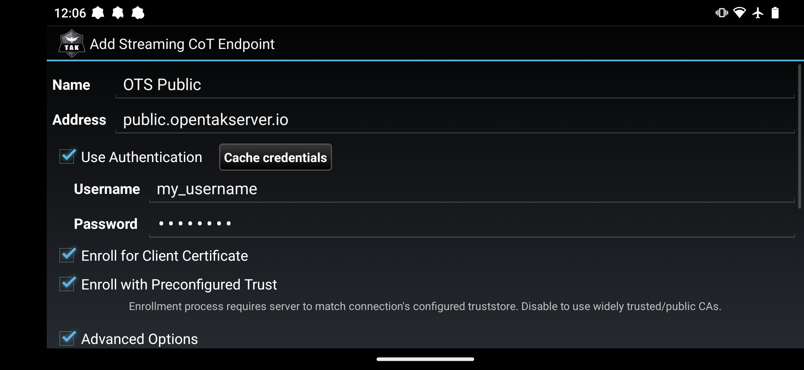
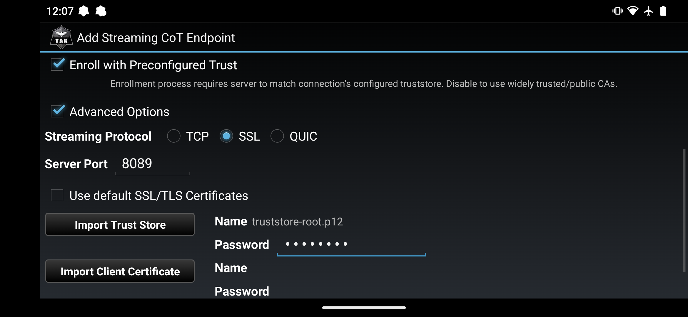
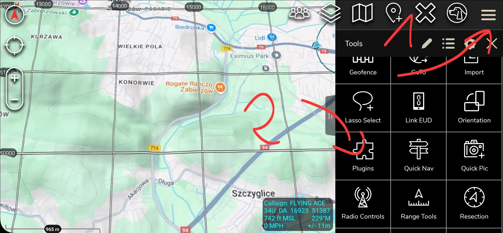
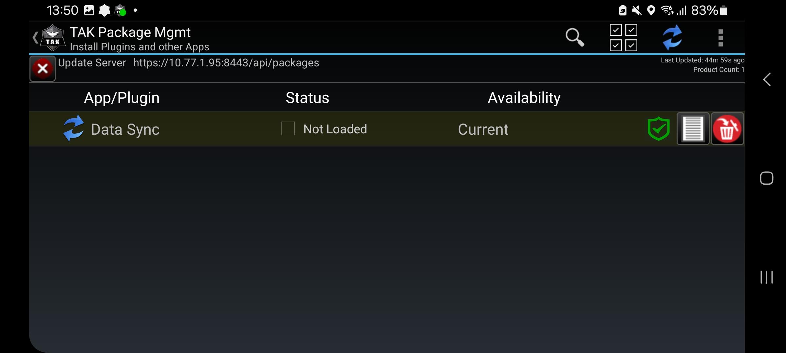
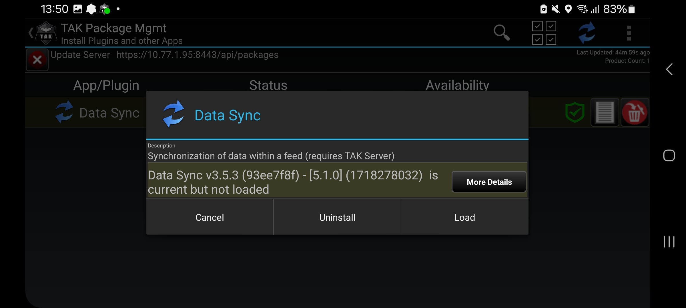
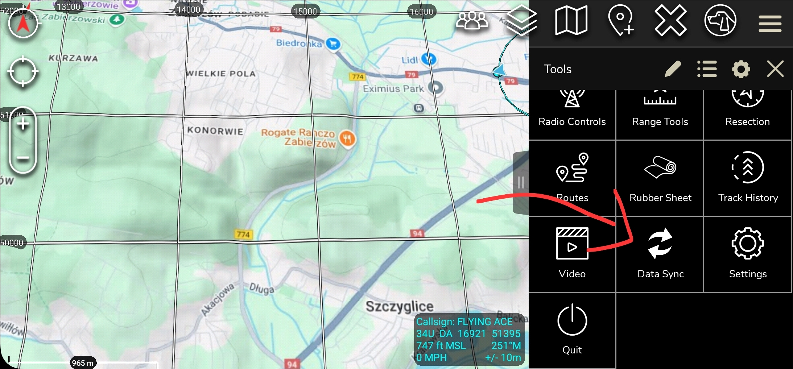
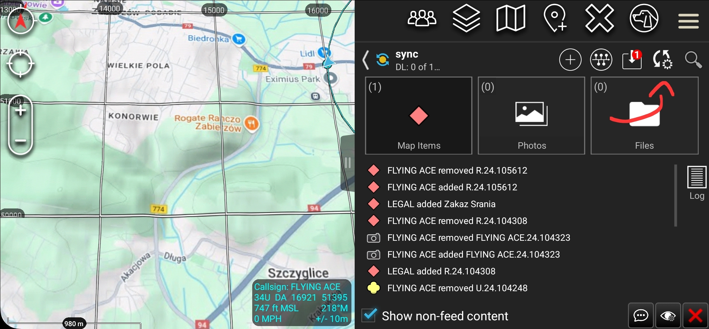

# ATAK Configuration Guide

Serwer address:
34.88.91.132

## Download and Install

You might need to allow for installations from unknown sources:

- **ATAK 5.1.0 APK**

**Download:**

- **Trust Store Certificate**

[Google Drive Download Link](https://drive.google.com/drive/folders/14vN5e-XUKfOhGlJxDgsvc94ErK-Y8C3p?usp=drive_link)

[Video Tutorial](https://www.youtube.com/watch?v=sutm_fiJoQY)

---

## Server Enrollment Steps

1. On the main ATAK screen, tap the hamburger icon in the top right corner and select **Settings**.
2. Tap on **Network Preferences**.
3. Tap on **TAK Servers**.
4. Tap the three vertical dots in the top right corner and select **Add**.
5. Fill out your server’s name and address.
6. Check the **Use Authentication** checkbox and enter your OpenTAKServer username and password.
    - Username: `user`
    - Password: `password`
7. Check the **Enroll for Client Certificate** checkbox.
8. Ensure **Streaming Protocol** is set to **SSL**.
9. The default server port is **8089** unless OpenTAKServer has been configured to use a different port. Ask your server admin if you are unsure.
10. Configure SSL/TLS Certificates:
    - **Self-signed certificates** (**USE THIS!**):
        - Uncheck **Use default SSL/TLS Certificates**.
        - Ensure **Enroll with Preconfigured Trust** is checked (option may not be available on older ATAK versions).
        - Tap **Import Trust Store** and select your trust store file.
        - Enter your trust store certificate’s password (default: `atakatak`).
        - Tap **OK**.
11. Tap the **OK** button at the bottom of the screen.
12. After a few seconds, you should see a message that registration has succeeded and you will be automatically connected to the server.
13. Any data packages, plugins, and device profiles set by the server admin to install on enrollment will be automatically installed.
14. On enrollment you will be prompted by ATAK to install the DataSync plugin, give it required permissions and proceed with the installation. Enable the plugin when prompted.

---

---

## Alternative Way to Install & Enable DataSync

1. Go to **Options > Plugins** and click the DataSync plugin and agree to load it.

    

2. Now click on the DataSync plugin, and load it:

    
    

3. It shows up here:

    

---

### DataSync Usage Tutorial

[YouTube: How to use DataSync](https://www.youtube.com/watch?v=GlVNcH5tmZg)

---

## Auto Sync Feed Tutorial

1. Go to **Feed > Settings**:

    

2. Scroll down and click:

    
